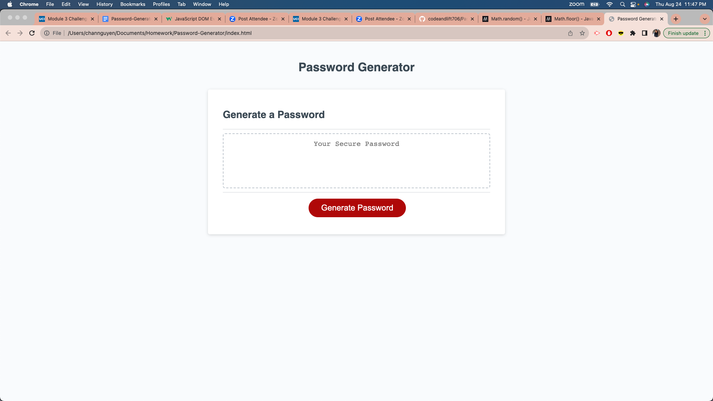

# Password-Generator

## Table of Contents
- [Description](#description)
- [Installation](#installation)
- [Usage](#usage)
- [License](#license)
- [Contribution](#contribution)
- [Questions](#questions)

## Description
The goal of creating a Password-Generator through the web browser is to provide a source for users to retrieve a random password that fits the unique criteria. The content of the web page itself contains a button to “Generate Password”, and a text box that will generate the random code.
The deployed application can be found here: https://codeandlift706.github.io/Password-Generator/.

## Installation
VS Code to create and manipulate HTML, CSS, and JavaScript elements for the app on the browser page. GitHub to clone the repository content https://github.com/coding-boot-camp/friendly-parakeet, for version control, and for app deployment.

## Usage
Users can clone this application to generate a random password.

View a screenshot of the app here:

## License
This project is under the MIT license.

## Contribution
The web page and its images are credited to the content in the starter-code repository, found here: https://github.com/coding-boot-camp/friendly-parakeet. The coding (EventListener, arrays, passing, for loops, functions, etc) -all the additions- that were made to the web page are credited to the curriculum taught in the UCI coding boot camp. I also received assistance from classmates in the UCI coding boot camp and ASKBCS Assistant for the generatePassword function.
Source for information on addEventListener: https://www.w3schools.com/js/js_htmldom_eventlistener.asp.
Source for parseInt: https://developer.mozilla.org/en-US/docs/Web/JavaScript/Reference/Global_Objects/parseInt.
Source for math-random: https://developer.mozilla.org/en-US/docs/Web/JavaScript/Reference/Global_Objects/Math/random.
Source for math-floor: https://developer.mozilla.org/en-US/docs/Web/JavaScript/Reference/Global_Objects/Math/floor.

## Questions
The link to my Github Profile here: https://github.com/codeandlift706.
For any additional questions, please reach me at: channguyen715@gmail.com.
