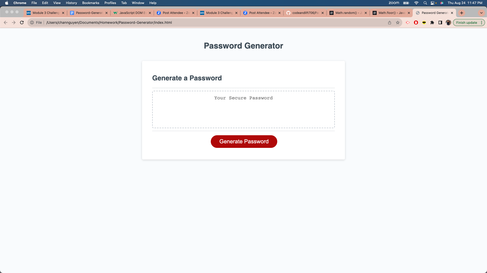
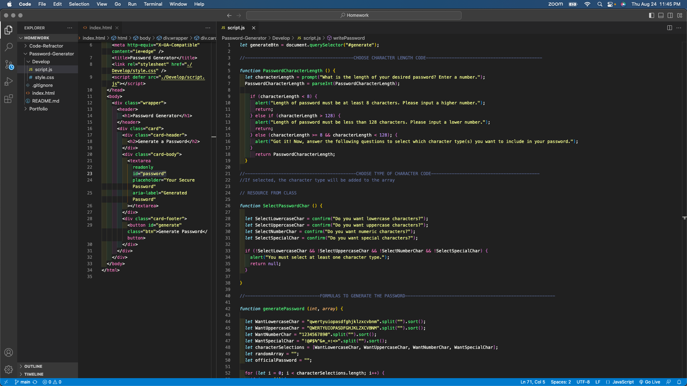

# Password-Generator
The goal of creating a Password-Generator through the web browser is to provide a source for users to retrieve a random password that fits the unique criteria. The content of the web page itself contains a button to “Generate Password”, and a text box that will generate the random code.
The deployed application can be found here: https://codeandlift706.github.io/Password-Generator/.

## Installation
VS Code to create and manipulate HTML, CSS, and JavaScript elements for the app on the browser page. GitHub for version control and app deployment.

## Visuals
View a screenshot of the app here:

View a screenshot of the VS Code here:

## Credits
The web page and its images are credited to the content in the starter-code repository, found here: https://github.com/coding-boot-camp/friendly-parakeet. The coding (EventListener, arrays, passing, for loops, functions, etc) -all the additions- that were made to the web page are credited to the curriculum taught in the UCI coding boot camp and are credited to the instructor and classmates in the UCI coding boot camp
Source for information on addEventListener: https://www.w3schools.com/js/js_htmldom_eventlistener.asp.
Source for parseInt: https://developer.mozilla.org/en-US/docs/Web/JavaScript/Reference/Global_Objects/parseInt.
Source for math-random: https://developer.mozilla.org/en-US/docs/Web/JavaScript/Reference/Global_Objects/Math/random.
